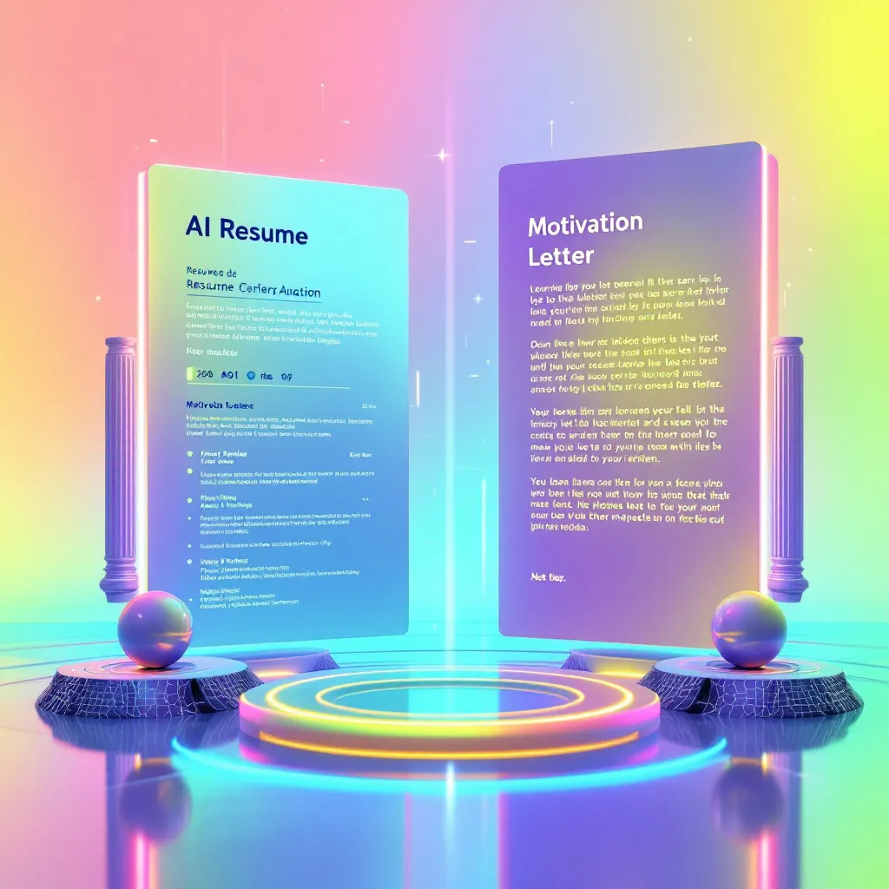

# AI Resume Assistant



An AI-powered application that helps job seekers optimize their CVs for ATS systems and generate tailored motivation letters.

**Current Version:** 1.0.0-beta  
**Last Updated:** 2025-03-06

## 📋 Overview

AI Resume Assistant is a web application that streamlines the job application process by leveraging artificial intelligence to analyze CVs against specific job descriptions and generate customized motivation letters. The application focuses on improving ATS (Applicant Tracking System) compatibility to increase the chances of getting interviews.

## ✨ Features

### Current Features

- **CV Upload and Processing**
  - PDF upload and parsing
  - CV content extraction for analysis
  - Visual PDF preview

- **Job Details Management**
  - Structured job information input (title, company, hiring manager)
  - Job description analysis
  - Smart form validation

- **AI-Powered CV Analysis**
  - ATS compatibility scoring (0-100)
  - Keyword matching against job requirements
  - Strengths and gaps identification
  - Personalized improvement suggestions

- **Custom Motivation Letter Generation**
  - Multiple letter styles (Professional, Enthusiastic, Creative, Balanced)
  - Custom instruction support
  - Interactive editor with preview
  - Download and copy functionality

- **Applications Management**
  - Save applications for future reference
  - View all applications in a centralized dashboard

### Technical Features

- Responsive design works on all devices
- Dark/light mode support
- Modern UI with smooth transitions
- TypeScript for type safety
- Component-based architecture

## 🛠️ Tech Stack

- **Frontend**
  - Next.js 14+ (React framework)
  - TypeScript
  - Tailwind CSS for styling
  - Framer Motion for animations
  - Lucide for icons

- **AI Integration**
  - Integration-ready for OpenAI API
  - Structured prompt templates
  - Mock data for development

- **Development**
  - ESLint for code quality
  - Organized project structure
  - Type definitions

## 🚀 Getting Started

### Prerequisites

- Node.js 18.0.0 or later
- npm or yarn
- Git

### Installation

1. Clone the repository
   ```bash
   git clone https://github.com/yourusername/ai-resume-assistant.git
   cd ai-resume-assistant
   ```

2. Install dependencies
   ```bash
   npm install
   # or
   yarn install
   ```

3. Set up environment variables
   ```bash
   cp .env.example .env.local
   ```
   Edit `.env.local` to add your API keys (optional for development with mock data)

4. Start the development server
   ```bash
   npm run dev
   # or
   yarn dev
   ```

5. Open [http://localhost:3000](http://localhost:3000) in your browser

## 📝 Usage Guide

### Creating a New Application

1. **Upload CV**
   - Upload your CV in PDF format
   - The system will extract text for analysis

2. **Enter Job Details**
   - Input company information, job title, and hiring manager details
   - Paste the complete job description

3. **Review CV Analysis**
   - Examine ATS compatibility score
   - Review strengths and gaps
   - Check keyword matches
   - Get suggestions for improvement

4. **Generate Motivation Letter**
   - Select a letter style
   - Add custom instructions if needed
   - Edit the generated letter
   - Download or copy to clipboard
   - Save your application

### Managing Applications

- View all your saved applications in the applications dashboard
- Filter applications by company or job title
- Download letters for saved applications

## 🔮 Roadmap & Future Features

### Short-term Plans

- **AI Integration Improvements**
  - Connect to real OpenAI API for production use
  - Optimize prompts for better results
  - Add streaming response support for real-time letter generation

- **CV Editor**
  - Implement in-app CV editing based on AI suggestions
  - Visual CV builder with templates
  - Real-time ATS score updating during edits

- **Enhanced Analytics**
  - Visual representation of keyword matches
  - Competition analysis for job positions
  - Industry-specific advice

### Long-term Vision

- **Multi-language Support**
  - Support for CVs and jobs in multiple languages
  - Region-specific formatting options

- **Job Search Integration**
  - Connection to job boards APIs
  - Automated job matching based on CV content
  - One-click apply functionality

- **Interview Preparation**
  - AI-generated interview questions based on job description
  - Practice interview module with feedback
  - Custom interview preparation notes

- **Career Development**
  - Skill gap analysis for career progression
  - Course recommendations for skill development
  - Career path visualization

## 👥 Contributing

Contributions are welcome! Please feel free to submit a Pull Request.

1. Fork the repository
2. Create your feature branch (`git checkout -b feature/amazing-feature`)
3. Commit your changes (`git commit -m 'Add some amazing feature'`)
4. Push to the branch (`git push origin feature/amazing-feature`)
5. Open a Pull Request

## 📄 License

This project is licensed under the MIT License - see the LICENSE file for details.

## 🙏 Acknowledgements

- OpenAI for GPT technology
- Next.js team for the amazing framework
- All open-source contributors whose libraries made this possible